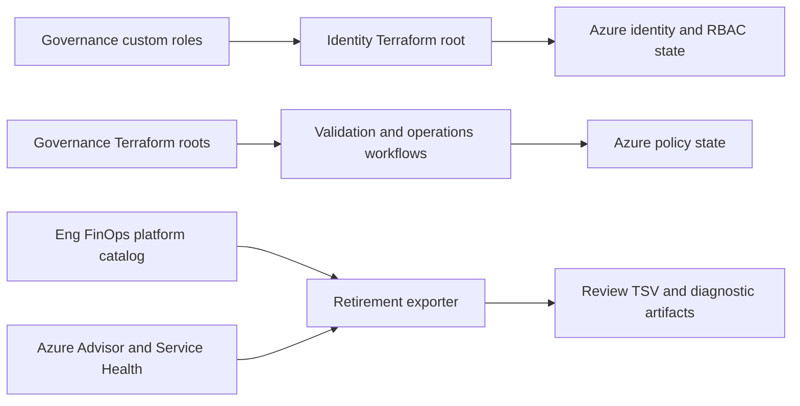

# Architecture

## 1. Purpose

`eng-azure-governance` contains Azure policy governance, workload identity, an Eng FinOps subscription catalog, and an Azure retirement evidence exporter. This document describes their current components, state and schema boundaries, dependencies, workflows, and validation paths.

## 2. System overview

Azure Governance defines custom roles, policy definitions, policy sets, and assignments in numbered Terraform roots.
Identity provisions the production user-assigned identity, GitHub environment federation, and Azure role grants in separate Terraform state.
The Eng FinOps Platform Catalog maps subscription names to platforms under a versioned YAML schema.
Azure Retirement Intelligence collects Azure evidence and consumes active platform mappings while producing review artifacts.
GitHub Actions validate source, detect drift, and invoke remediation or container-job operations.
Checked-in files evidence two cross-domain dependencies but do not bind Identity outputs to GitHub secret values.

The diagram shows the two evidenced cross-domain edges: governance-defined role names are consumed by Identity grants, and active catalog mappings are consumed during retirement aggregation.

## 3. Current vs intended architecture

| Area | Current architecture | Intended architecture | Status | Evidence |
| --- | --- | --- | --- | --- |
| Azure Governance | Numbered Terraform roots define roles, policy families, policy sets, and assignments. | No separate intended architecture is documented; preserve the current stage separation. | Documented | `README.md`, `src/01_custom_roles/`, `src/02_policy_*`, `src/03_policy_set/`, `src/04_policy_assignments/` |
| Identity | A hidden Terraform root provisions the production identity, GitHub environment federation, and Azure role grants in independent state. | No separate intended architecture is documented. | Evidenced | `.identity/00_main.tf`, `.identity/02_identity_prod.tf`, `.identity/02_identity_prod_auth.tf`, `.identity/env/prod/backend.tfvars` |
| Eng FinOps Platform Catalog | A versioned YAML catalog maps Azure subscriptions to organizational platforms and is read by the retirement aggregate stage. | No separate intended architecture is documented. | Documented | `src/_source_of_truth/README.md`, `src/_source_of_truth/eng-finops-platforms.yaml`, `src/comitato/comitato_azure_retirements/libs/platform_catalog.py` |
| Azure Retirement Intelligence | A Python runtime collects, normalizes, aggregates, and projects retirement evidence into TSV artifacts. | No separate intended architecture is documented; preserve the runtime contracts and explicit diagnostics. | Documented | `src/comitato/comitato_azure_retirements/README.md`, `docs/comitato-azure-retirements-runtime.md` |

## 4. Technology stack

| Area | Technology | Status | Evidence |
| --- | --- | --- | --- |
| Governance definitions | Terraform and AzureRM resources | Evidenced | `src/01_custom_roles/`, `src/02_policy_api_management/`, `src/03_policy_set/`, `src/04_policy_assignments/`, `.terraform-version` |
| Workload identity | Terraform with AzureRM and AzureAD providers | Evidenced | `.identity/00_main.tf`, `.identity/.terraform.lock.hcl` |
| Platform catalog | YAML schema with a Python reader | Evidenced | `src/_source_of_truth/eng-finops-platforms.yaml`, `src/comitato/comitato_azure_retirements/libs/platform_catalog.py` |
| Governance automation | Bash, Azure CLI, GitHub Actions | Evidenced | `src/scripts/*.sh`, `.github/workflows/` |
| Retirement runtime | Python 3.13.9, `requests`, `urllib3`, `rich`, and `pandas` | Documented | `.python-version`, `src/comitato/comitato_azure_retirements/README.md`, `src/comitato/comitato_azure_retirements/requirements.txt` |
| Validation | pre-commit, Terraform validation, Ruff, ShellCheck, Python compile checks, pytest | Evidenced | `.pre-commit-config.yaml`, `.github/workflows/_pre-commit.yml`, `.github/workflows/_code-analysis.yml` |

## 5. Repository map

| Path | Responsibility | Notes |
| --- | --- | --- |
| `.identity/` | Provisions the production workload identity, federation, and Azure role grants. | Independent Terraform backend and wrapper. |
| `src/01_custom_roles/` | Defines custom Azure RBAC roles. | First numbered governance stage. |
| `src/02_policy_*/` | Defines service- or concern-specific Azure Policy families. | Each family has its own Terraform wrapper and state configuration. |
| `src/03_policy_set/` | Groups policy definitions into initiatives. | Reads the governance hierarchy and composes policy sets. |
| `src/04_policy_assignments/` | Assigns policy controls to governance scopes. | Final numbered governance stage. |
| `src/_source_of_truth/` | Owns the canonical Eng FinOps platform catalog. | Consumed by retirement aggregation. |
| `src/scripts/` | Runs remediation and container job scaling operations. | Invoked by dedicated workflows. |
| `src/comitato/comitato_azure_retirements/` | Collects and publishes retirement evidence. | Python CLI and Bash launcher with its own requirements and tests. |
| `tests/comitato/comitato_azure_retirements/` | Tests the retirement runtime. | Executed by the code-analysis workflow. |
| `.github/workflows/` | Validates, releases, detects drift, remediates, and runs automation. | Workflows use pinned action revisions. |
| `docs/domain/` | Defines the four repository vocabularies and evidenced rules. | Selected through `CONTEXT-MAP.md`. |
| `.pre-commit-config.yaml` | Defines local and CI validation hooks. | Terraform, Python, Bash, YAML, JSON, and action checks. |

## 6. Architectural boundaries

- **Governance definitions to Azure state - downstream:** Terraform roots describe Azure roles, policies, initiatives, and assignments; workflows and wrappers execute the changes. Evidence: `src/01_custom_roles/`, `src/02_policy_*`, `src/03_policy_set/`, `src/04_policy_assignments/`, `.github/workflows/`.
- **Azure Governance to Identity - downstream:** Identity grants reference the governance-defined `PagoPA Policy Reader` and `PagoPA Policy Remediator` roles by stable name. Evidence: `src/01_custom_roles/01_policy_reader.tf`, `src/01_custom_roles/01_policy_remediator.tf`, `.identity/02_identity_prod_auth.tf`.
- **Identity root to Azure identity state - downstream:** the root provisions a user-assigned identity, repository federation, and role grants through its own backend. Evidence: `.identity/00_main.tf`, `.identity/02_identity_prod.tf`, `.identity/02_identity_prod_auth.tf`, `.identity/env/prod/backend.tfvars`.
- **Governance workflows to Azure - downstream:** drift detection and remediation authenticate with Azure and operate on policy state. Evidence: `.github/workflows/terraform_drift.yml`, `.github/workflows/policy_remediation.yml`, `src/scripts/policy_remediation.sh`.
- **Eng FinOps Platform Catalog to retirement runtime - downstream:** aggregate generation loads active subscription-to-platform mappings from the canonical catalog. Evidence: `src/_source_of_truth/eng-finops-platforms.yaml`, `src/comitato/comitato_azure_retirements/libs/runtime_runner.py`, `src/comitato/comitato_azure_retirements/libs/platform_catalog.py`.
- **Azure sources to retirement runtime - upstream:** Advisor and Service Health APIs provide source evidence to the retirement exporter. Evidence: `src/comitato/comitato_azure_retirements/libs/advisor.py`, `src/comitato/comitato_azure_retirements/libs/service_health.py`, `src/comitato/comitato_azure_retirements/libs/runtime_live.py`.
- **Retirement runtime to review artifacts - downstream:** the runtime writes TSV, diagnostics, manifest, and debug-log artifacts. Evidence: `docs/comitato-azure-retirements-runtime.md`, `src/comitato/comitato_azure_retirements/libs/runtime_runner.py`.
- **Other domain pairs - free:** no other domain-to-domain data or control dependency is evidenced. In particular, repository files do not map `.identity` outputs to GitHub environment secret values. Evidence: `CONTEXT-MAP.md`, `.identity/99_outputs.tf`, `.github/workflows/`.

## 7. Dependency rules

### Allowed direction

- Governance changes flow from custom roles to policy definitions, initiatives, and assignments in numbered apply order; later roots consume earlier remote state where declared.
- Identity grants may reference existing governance-defined custom roles by stable name.
- Active platform mappings flow from the canonical catalog into retirement aggregate and slide artifacts.
- Azure retirement evidence flows from Azure source APIs through the runtime to documented review artifacts.

### Avoid / forbidden

- Keep Identity grants in `.identity` and custom role definitions in `src/01_custom_roles/`; changing that boundary requires a new architectural decision. Evidence: `README.md`, `docs/adr/0001-domain-layout.md`.
- Do not use catalog subscription IDs as runtime matching keys or expose disabled and deleted entries as active mappings. Evidence: `src/_source_of_truth/README.md`, `docs/domain/eng-finops-platform-catalog/RULES.md`.
- Do not infer Service Health resource impact from names, regions, or labels. Evidence: `src/comitato/comitato_azure_retirements/README.md`.
- Do not validate Terraform against a remote backend in the local pre-commit path. Evidence: `.github/workflows/_pre-commit.yml`, `.pre-commit-config.yaml`.

## 8. Key flows

### Runtime flow

1. `run.sh` resolves Python, dependencies, mode, and scope.
2. The Python entrypoint builds a runtime route for `raw`, `aggregate`, `slide`, or `full`.
3. Live collection reads Advisor and Service Health evidence; fixture and schema-only modes provide bounded alternatives.
4. Aggregate execution validates the Eng FinOps platform catalog and maps active subscription names to platforms.
5. Runtime stages normalize source rows, aggregate them, project the committee-facing slide artifact, and write diagnostics and a manifest.
6. Human-readable debug logs correlate stages, failures, and artifact writes by run ID.

### Build/test flow

1. The pre-commit workflow runs repository hooks, including Terraform formatting and validation, actionlint, ShellCheck, Python checks, and Terraform linting.
2. The code-analysis workflow creates an ephemeral Python environment from the repository version and locked requirements.
3. It compiles Python, checks the CLI help path, parses Bash scripts, and runs the retirement pytest suite.

### Deployment/operations flow

1. Terraform roots are operated through their local `terraform.sh` wrappers; no checked-in workflow applies the numbered roots or `.identity`.
2. Terraform drift detection loops through every immediate directory under `src/` except `scripts/` and invokes `./terraform.sh plan`.
3. The policy remediation workflow authenticates to Azure and creates remediation tasks for non-compliant definitions in selected policy sets.
4. The container app job workflow queries Azure Resource Graph and scales matching self-hosted-runner jobs to zero minimum executions.
5. Failure notifications are sent through the configured Slack action in the operational workflows.

## 9. Configuration and environment

- `.terraform-version` selects the Terraform version used by drift and local wrappers.
- Governance Terraform roots use a root `backend.ini` or an environment directory, depending on the local wrapper; wrapper arguments are not uniform. Evidence: `src/01_custom_roles/backend.ini`, `src/01_custom_roles/terraform.sh`, `src/04_policy_assignments/env/org/`, `src/04_policy_assignments/terraform.sh`.
- `.identity/env/prod/` configures the independent Identity backend and variables; documentation does not reproduce checked-in identifiers.
- `.python-version` selects Python `3.13.9` for the retirement launcher and CI.
- `src/comitato/comitato_azure_retirements/config/azure_rel.conf` controls allowed regions and logging thresholds.
- `src/_source_of_truth/eng-finops-platforms.yaml` is the canonical catalog used during retirement aggregation.
- Retirement CLI flags override environment variables such as `AZURE_SUBSCRIPTIONS`, `AZURE_MANAGEMENT_GROUPS`, and `AZURE_RETIREMENTS_OUTPUT_ROOT`. Evidence: `src/comitato/comitato_azure_retirements/README.md`, `src/comitato/comitato_azure_retirements/libs/config.py`.
- Workflows obtain Azure access through GitHub environment secrets and OIDC permissions. Their checked-in definitions do not prove how those secret values relate to `.identity` outputs.

## 10. Testing and validation

| Change type | Suggested validation | Evidence |
| --- | --- | --- |
| Identity Terraform | `terraform fmt -check -recursive .identity`; targeted pre-commit validation with the backend disabled. | `.identity/`, `.pre-commit-config.yaml`, `.github/workflows/_pre-commit.yml` |
| Governance Terraform or policy definition | `terraform fmt -check -recursive src`; targeted pre-commit validation with the backend disabled; a wrapper plan where Azure access is available. | `.pre-commit-config.yaml`, `.github/workflows/_pre-commit.yml`, `.github/PULL_REQUEST_TEMPLATE.md` |
| Platform catalog | Focused platform-catalog pytest, followed by the retirement suite when consumer behavior changes. | `tests/comitato/comitato_azure_retirements/test_platform_catalog.py`, `Makefile` |
| Bash workflow or operational script | `bash -n <script>` and ShellCheck; actionlint for workflow changes. | `.pre-commit-config.yaml`, `.github/workflows/_code-analysis.yml` |
| Retirement runtime | Python compile check, retirement pytest suite, launcher `--help`, and schema-only run when dependencies are available. | `.github/workflows/_code-analysis.yml`, `src/comitato/comitato_azure_retirements/README.md` |
| Documentation | Markdown syntax plus local link and anchor checks, then pre-commit on the selected paths. | `.github/instructions/internal-markdown.instructions.md`, `.pre-commit-config.yaml` |

## 11. Architectural decisions visible in the repo

| Decision | Status | Evidence | Trade-off | Related ADR |
| --- | --- | --- | --- | --- |
| Separate governance controls into numbered role, policy, policy-set, and assignment roots. | Evidenced | `README.md`, `src/01_custom_roles/`, `src/02_policy_*`, `src/03_policy_set/`, `src/04_policy_assignments/` | Clear apply boundaries at the cost of many Terraform roots. | None |
| Provision the production workload identity and grants in an independent Terraform root. | Evidenced | `.identity/` | Isolates identity state at the cost of a separate execution path. | None |
| Keep the platform catalog versioned and expose only active name mappings to the runtime. | Documented | `src/_source_of_truth/README.md`, `src/comitato/comitato_azure_retirements/libs/platform_catalog.py` | Preserves lifecycle history while excluding inactive entries from current reporting. | None |
| Keep retirement collection and projection as a Python CLI with raw, aggregate, and slide stages. | Evidenced | `src/comitato/comitato_azure_retirements/README.md`, `docs/comitato-azure-retirements-runtime.md` | Preserves traceability at the cost of multiple intermediate artifacts. | None |
| Use a four-domain context map for repository knowledge. | Accepted | `CONTEXT-MAP.md`, `docs/domain/` | Preserves distinct vocabularies and boundaries at the cost of additional navigation. | [ADR-0001](adr/0001-domain-layout.md) |

## 12. AI-agent working rules

- Read this document, `CONTEXT-MAP.md`, and the applicable domain context before making structural changes.
- Preserve existing repository patterns and boundaries; keep changes scoped to the owning domain or component.
- Prefer existing repository patterns over new abstractions.
- Do not introduce new frameworks or cross-cutting refactors without explicit approval.
- Update this document when an intentional architectural change alters a boundary, flow, dependency, or state lifecycle.
- Report evidence conflicts before editing and downgrade unresolved claims to the unknowns below.

## 13. Last verified

- Verification date: 2026-09-01.
- Agent or tool: GitHub Copilot using the internal-knowledge bootstrap workflow and the existing graphify repository graph.
- Files inspected: repository instructions, root and component READMEs, Terraform roots and backend shapes, workflows, pre-commit configuration, catalog reader and tests, retirement runtime entrypoints and tests, and existing knowledge documents.
- Commands considered or run: `git status --short`; the existing-graph query for knowledge domains, significant components, architecture boundaries, source-of-truth flows, validation entrypoints, and repository documentation; targeted repository searches; Markdown, link, anchor, scope, and repository checks.
- Confidence: high for checked-in boundaries, schema contracts, and dependency direction; medium for live Azure identity and scope bindings because they are not executed or exposed by repository evidence.

## 14. Unknown / To verify

- The complete per-family ownership and state model for all `src/02_policy_*` roots.
- The exact Azure tenant, subscription, management-group, and managed-identity topology used by production workflows.
- Whether `.identity` outputs populate the `AZ_*` GitHub environment secrets; checked-in names alone do not prove that binding.
- The drift workflow invokes `./terraform.sh` in every immediate `src/` directory except `scripts/`, but `_source_of_truth/` and `comitato/` do not own that wrapper. The scheduled path needs operational verification.
- `docs/comitato-azure-retirements-runtime.md` still describes the debug log as JSON Lines, while the implementation, tests, and component README use human-readable text.
- Whether every runtime contract is covered by a dedicated automated test; the workflow proves only the tests it runs.
- The ignored `src/comitato/comitato_azure_retirements_v2/` directory has no tracked source evidence and is excluded from this architecture.
